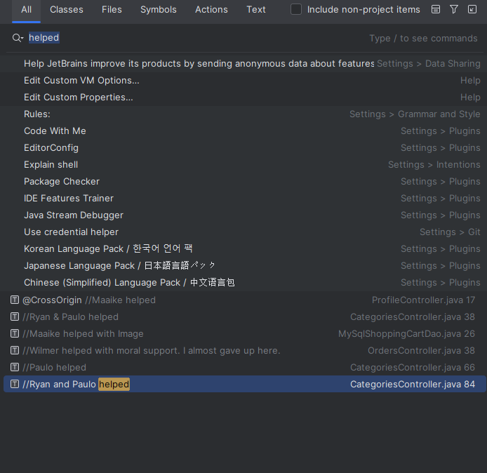

<p align="center">
  
</p>

<h1 align="center">EasyShop E-Commerce API</h1>

EasyShop is a Java Spring Boot backend application built to simulate a full-featured e-commerce system. It includes user authentication, product browsing, category management, shopping cart functionality, and a simple checkout process.

---

## User Roles

- **Admin**  
  Can manage (create, update, delete) products and categories.

- **Authenticated User**  
  Can browse products, manage cart, update profile, and checkout.

---

## Screenshots

<details>
  <summary>Click to expand</summary>

> Adding new category in Postman


> Deleting existing category in Postman


</details>

---

## Code Highlight – Frontend CSS Customization

I refactored the frontend styles to use a **dark-neutral theme** with warm, earthy tones inspired by natural shades. This provides a modern, elegant, and user-friendly UI.

<details>
  <summary>Click to expand</summary>

```css
:root {
    --primary-dark: #5e4b3c;
    --primary: #8d735d;
    --primary-medium: #b3957a;
    --primary-light: #e6d3c2;
    --text-color: #fffaf6;
    --background-color: #2b1f18;
}

button,
.btn {
    background-color: var(--primary-medium);
    color: var(--text-color);
    border: none;
    padding: 8px 16px;
    border-radius: 8px;
    font-weight: 600;
    transition: background-color 0.3s ease;
}

button:hover,
.btn:hover {
    background-color: var(--primary-dark);
    color: var(--text-color);
}
```
> Before


> After


</details>

---

## Tech Stack

<details>
  <summary>Click to expand</summary>

- Java 17
- Spring Boot
- Spring Security
- MySQL
- JDBC
- REST API
- Postman (for testing)
- Git + GitHub (version control)

</details>

---

## Acknowledgments

Special thanks to:
- My instructor Maaike and peers for feedback, guidance, & patience. I am forever grateful for all of you!

<details>
  <summary>Click to see where my classmates & Maaike helped</summary>



</details>

- **ChatGPT by OpenAI** for helping with code refactoring, debugging, and content writing support in the front end.

<details>
  <summary>Click to see where ChatGPT helped</summary>


</details>